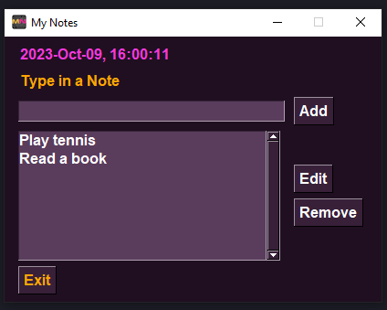
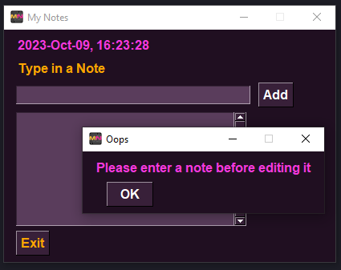

## MyNotes 2.0

---

A simple yet powerful note-taking app built with Python and PySimpleGUI.

---

**Key Features**

- Create, edit, and delete notes.
- Organize notes into categories.
- Cross-platform support (Windows, macOS, Linux).
- Minimalistic and user-friendly interface in synthwave style.

---
**Technologies Used**

- Python
- PySimpleGUI

---

**Installation and Usage**

1. Clone the repository.
2. Install dependencies with `pip install -r requirements.txt`.
3. Run the app with `python main.py`.
---
**Examples and Screenshots**

 

---

**Contributing**

Contributions are welcome! Feel free to open issues or submit pull requests. Please follow our [contribution guidelines](CONTRIBUTING.md).

---

**License**

This project is licensed under the MIT License - see the [LICENSE](LICENSE) file for details.

---

**Author**

John Doe
- GitHub: [github.com/Armen-Jean-Andreasian](https://github.com/Armen-Jean-Andreasian)
- Email: armen_andreasian@proton.me

---

**Project Status**

Actively maintained.

---
